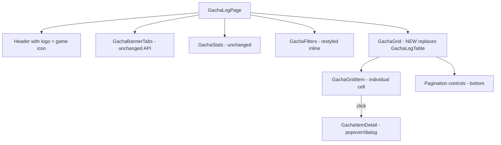

# Gacha Log Redesign Plan

## Problem Statement

The current gacha log page uses a generic table layout that:
1. Makes item images too small (8x8 / 32px) — users recognize gacha items by image, not name
2. Wastes space on text columns when names aren't the primary identifier
3. Lacks the "Hoyo Buddy feel" present in the login flow pages (decorative blobs, accent gradients, `bg-texture`, brand typography)
4. Has a theme toggle that should be removed

## Design Direction

**Aesthetic**: Refined gacha-collector — image-forward grid with rarity-colored backgrounds, matching the existing Hoyo Buddy brand language (oklch colors, Sora display font, DM Sans body, decorative blobs, `bg-texture` overlay, `page-enter` animations).

**Key Inspiration**: The reference screenshot shows a dense grid of circular item icons with colored backgrounds per rarity, pity counters on select items, and pull numbers. We adapt this to the Hoyo Buddy visual identity with rounded-rectangle cards instead of circles, and integrate the existing design tokens.

## Architecture

### Component Flow



### Data Flow — No API Changes

The existing hooks and API layer remain unchanged:
- [`useGachaLogs`](src/hooks/use-gacha.ts:5) — fetches paginated items (change `size` from 20 → 100)
- [`useGachaIcons`](src/hooks/use-gacha.ts:14) — icon URL map
- [`useGachaNames`](src/hooks/use-gacha.ts:22) — name map
- [`GachaItem`](src/api/types.ts:123) type — `id`, `item_id`, `rarity`, `num`, `num_since_last`, `wish_id`, `time`, `banner_type`

### Rarity Color System

Extend [`RARITY_COLORS`](src/lib/constants.ts:162) and [`RARITY_ROW_COLORS`](src/lib/constants.ts:169) with new grid-specific background maps using oklch:

| Rarity | Grid BG (light) | Grid BG (dark) | Border accent |
|--------|-----------------|----------------|---------------|
| 5★ | `oklch(0.85 0.12 85)` warm gold | `oklch(0.40 0.10 85)` deep gold | `oklch(0.75 0.14 85)` |
| 4★ | `oklch(0.82 0.12 300)` soft purple | `oklch(0.35 0.12 300)` deep purple | `oklch(0.65 0.15 300)` |
| 3★ | `oklch(0.85 0.08 240)` soft blue | `oklch(0.32 0.08 240)` deep blue | `oklch(0.60 0.10 240)` |
| 2★ | `oklch(0.85 0.08 150)` soft green | `oklch(0.32 0.08 150)` deep green | `oklch(0.60 0.10 150)` |

## File Changes

### New Files
- `src/components/gacha/gacha-grid.tsx` — grid container + pagination
- `src/components/gacha/gacha-grid-item.tsx` — individual grid cell with rarity bg, image, pity badge, pull number
- `src/components/gacha/gacha-item-detail.tsx` — click popover showing item ID, name, pull date, pity

### Modified Files
- `src/pages/gacha-log.tsx` — replace `GachaLogTable` with `GachaGrid`, remove `ThemeToggle`, change `size` to 100, add game icon to header, add Hoyo Buddy aesthetic (decorative blobs, accent gradient)
- `src/lib/constants.ts` — add `RARITY_GRID_BG` and `RARITY_GRID_BG_DARK` color maps
- `src/components/gacha/gacha-filters.tsx` — restyle to match new aesthetic (integrated into page header area)
- `src/locales/en-US.json` — add new i18n keys for detail popover
- `src/locales/zh-TW.json` — add corresponding zh-TW keys

### Deleted / Deprecated
- `src/components/gacha/gacha-log-table.tsx` — replaced by grid; delete file

## Detailed Component Specs

### 1. `GachaGrid` — Grid Container

**Props**: Same as current `GachaLogTableProps` (items, total, page, max_page, isLoading, icons, names, onPageChange)

**Layout**:
- CSS Grid: `grid-template-columns: repeat(auto-fill, minmax(72px, 1fr))` with `gap: 6px`
- Responsive: cells are ~72-80px on desktop, auto-fill adapts to viewport width
- Max width: `max-w-6xl` (wider than current `max-w-5xl` to accommodate grid density)

**Pagination**: Bottom bar with:
- Left: "Page X of Y · Z total" text
- Right: Previous/Next buttons using existing `Pagination` components
- Keyboard: Left/Right arrow keys for page navigation

**Loading state**: Skeleton grid of placeholder cells (shimmer rectangles in grid)

### 2. `GachaGridItem` — Individual Cell

**Structure**:
```
┌──────────────┐
│ [pity]       │  ← top-left: pity badge (4★/5★ only, if num_since_last > 0)
│              │
│   [image]    │  ← center: item icon, ~48-56px, object-cover
│              │
│        [#N]  │  ← bottom-right: pull number (item.num)
└──────────────┘
```

**Rarity background**: Each cell gets a background color from `RARITY_GRID_BG` / `RARITY_GRID_BG_DARK` based on `item.rarity`. Uses CSS `light-dark()` or conditional class.

**Pity badge**: Small pill/badge in top-left corner, only shown for rarity 4 and 5. Shows `num_since_last` value. Styled with semi-transparent dark overlay for readability.

**Pull number**: `#N` in bottom-right, small text with semi-transparent dark overlay background.

**Hover**: Show item name as native `title` attribute tooltip. Subtle scale transform (`scale(1.05)`) with transition.

**Click**: Opens `GachaItemDetail` popover/dialog.

### 3. `GachaItemDetail` — Click Detail View

Uses the existing shadcn [`Dialog`](src/components/ui/dialog.tsx) component (small, centered).

**Content**:
- Item icon (larger, ~96px)
- Item name (from `names` map)
- Item ID
- Pull date (formatted from `item.time`)
- Pity count (`num_since_last`)
- Rarity stars display

### 4. `GachaLogPage` — Redesigned Page

**Header area**:
- Logo + "Hoyo Buddy" branding (kept)
- Game icon next to "Gacha History" title (from `GAME_ICONS[game]`)
- Decorative background blobs matching login pages (accent color based on game)
- `bg-texture` overlay
- No ThemeToggle

**Filters**: Inline row below header:
- Rarity filter pills (styled as toggle buttons with rarity colors, not checkboxes)
- Search input (compact, integrated)
- Banner tabs (kept as-is, possibly restyled to match)

**Game accent colors** (new mapping for gacha page):
- `genshin` → gold `oklch(0.72 0.14 68)` 
- `hkrpg` → purple `oklch(0.55 0.18 295)`
- `nap` → teal `oklch(0.60 0.14 190)`
- `honkai3rd` → blue `oklch(0.55 0.16 265)`
- `tot` → pink `oklch(0.60 0.17 350)`

These drive the decorative blob colors and accent line in the header.

### 5. Filter Restyle

Replace checkbox-based rarity filter with **toggle pill buttons**:
- Each pill shows "5★", "4★", "3★", "2★"
- Active state: filled with rarity color
- Inactive state: ghost/outline
- Uses rarity-specific oklch colors for each pill

### 6. Stats Restyle

Keep existing [`GachaStats`](src/components/gacha/gacha-stats.tsx) component mostly as-is, but:
- Use game accent color for highlights instead of generic destructive
- Tighter integration with the header area

## Responsive Behavior

| Breakpoint | Grid columns | Cell size | Behavior |
|------------|-------------|-----------|----------|
| < 480px | ~4-5 cols | ~72px | Compact, touch-friendly |
| 480-768px | ~6-8 cols | ~76px | Standard mobile |
| 768-1024px | ~10-12 cols | ~78px | Tablet |
| 1024px+ | ~14-16 cols | ~80px | Desktop, matches reference density |

## Animation

- Page entrance: existing `page-enter` animation
- Grid items: `stagger-children` for initial load
- Item hover: `transform: scale(1.05)` with `transition: transform 0.15s ease`
- Page change: brief opacity fade on grid content swap (use `placeholderData` from TanStack Query to avoid flash)
