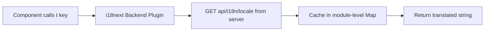
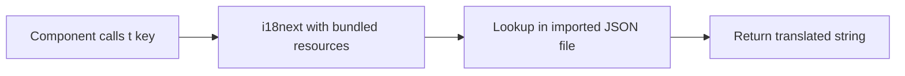

# i18n Revamp Plan: Backend-Fetched → Local JSON Translations

## Overview

Replace the current runtime backend-fetched i18n system with locally bundled JSON translation files. Support only **English (en-US)** and **Traditional Chinese (zh-TW)**. Pages exclusive to the Miyoushe platform will hardcode Simplified Chinese strings directly (no i18n system needed).

---

## Page Classification

### Miyoushe-Exclusive Pages (Hardcoded zh-CN)

These pages are **only** reachable after selecting the "miyoushe" platform and are intended exclusively for Chinese users. They will have `t()` calls removed and replaced with hardcoded Simplified Chinese strings:

| Page | File |
|------|------|
| Mobile OTP Login | `src/pages/login-mobile.tsx` |
| QR Code Login | `src/pages/login-qrcode.tsx` |
| Device Info | `src/pages/device-info.tsx` |

### Normal i18n Pages (en-US / zh-TW via translation system)

All other pages use the i18n system:

| Page | File |
|------|------|
| Home | `src/pages/home.tsx` |
| Platforms | `src/pages/platforms.tsx` |
| Login Methods | `src/pages/login-methods.tsx` |
| Email Login | `src/pages/login-email.tsx` |
| DevTools Cookies | `src/pages/login-devtools.tsx` |
| Raw Cookies | `src/pages/login-raw-cookies.tsx` |
| Mod App Login | `src/pages/login-mod-app.tsx` |
| Geetest | `src/pages/geetest.tsx` |
| Email Verify | `src/pages/email-verify.tsx` |
| Finish | `src/pages/finish.tsx` |
| OAuth Callback | `src/pages/oauth-callback.tsx` |
| Gacha Log | `src/pages/gacha-log.tsx` |
| Gacha components | `src/components/gacha/*.tsx` |
| Login Layout | `src/components/layout/login-layout.tsx` |
| Account Card | `src/components/accounts/account-card.tsx` |

---

## Architecture Changes

### Current Flow



### New Flow



### Files to Create

| File | Purpose |
|------|---------|
| `src/locales/en-US.json` | English source translations - all keys |
| `src/locales/zh-TW.json` | Traditional Chinese translations - all keys |

### Files to Modify

| File | Change |
|------|--------|
| `src/lib/i18n.ts` | Remove backend plugin, import JSON resources directly, configure with `resources` option |
| `src/lib/constants.ts` | Reduce `SUPPORTED_LOCALES` to only en-US and zh-TW; update `resolveLocale` |
| `src/components/ui/language-selector.tsx` | Works as-is since it reads from `SUPPORTED_LOCALES` |
| `src/pages/login-mobile.tsx` | Remove `useTranslation`, hardcode zh-CN strings |
| `src/pages/login-qrcode.tsx` | Remove `useTranslation`, hardcode zh-CN strings |
| `src/pages/device-info.tsx` | Remove `useTranslation`, hardcode zh-CN strings |
| `src/pages/home.tsx` | Add `useTranslation` + `t()` for hardcoded strings |
| `src/pages/oauth-callback.tsx` | Add `useTranslation` + `t()` for hardcoded strings |
| `src/pages/gacha-log.tsx` | Add `useTranslation` + `t()` for hardcoded strings |
| `src/components/gacha/gacha-banner-tabs.tsx` | Add `useTranslation` + `t()` for banner labels |
| `src/components/gacha/gacha-filters.tsx` | Add `useTranslation` + `t()` for labels |
| `src/components/gacha/gacha-log-table.tsx` | Add `useTranslation` + `t()` for table headers |
| `src/components/gacha/gacha-stats.tsx` | Add `useTranslation` + `t()` for stat labels |
| `src/components/accounts/account-card.tsx` | Add `useTranslation` + `t()` for labels |
| `src/components/layout/login-layout.tsx` | Add `useTranslation` + `t()` for `DEFAULT_SECURITY_NOTE` |
| All LoginLayout consumers | Pass translated panel props via `t()` |
| `src/pages/finish.tsx` | Add `t()` for toast messages |
| `src/pages/login-email.tsx` | Add `t()` for panel description, features, toasts |
| `src/pages/login-devtools.tsx` | Add `t()` for panel description, features, securityNote, toasts |
| `src/pages/login-raw-cookies.tsx` | Add `t()` for panel description, features, securityNote, toasts |
| `src/pages/login-mod-app.tsx` | Add `t()` for panel description, features, securityNote, toasts |
| `src/pages/login-methods.tsx` | Add `t()` for PLATFORM_META descriptions, features |
| `src/pages/platforms.tsx` | Add `t()` for features array |

### Files to Delete

| File | Reason |
|------|--------|
| `src/api/i18n.ts` | No longer fetching translations from backend |
| `src/hooks/use-i18n-backend.ts` | Backend plugin no longer needed |

### Files to Clean Up

| File | Change |
|------|--------|
| `src/api/types.ts` | Remove `I18nResponse` interface |

---

## New `src/lib/i18n.ts` Structure

```typescript
import i18n from 'i18next'
import { initReactI18next } from 'react-i18next'
import { resolveLocale } from '@/lib/constants'
import enUS from '@/locales/en-US.json'
import zhTW from '@/locales/zh-TW.json'

const detectedLocale = resolveLocale(navigator.language)

i18n.use(initReactI18next).init({
  lng: detectedLocale,
  fallbackLng: 'en-US',
  resources: {
    'en-US': { translation: enUS },
    'zh-TW': { translation: zhTW },
  },
  interpolation: {
    escapeValue: false,
  },
  react: {
    useSuspense: false,
  },
})

export default i18n
```

---

## Complete Translation Key Inventory

### Already Using `t()` — Existing Keys

These keys already exist as `t()` calls with English fallbacks. They need to be added to both JSON files:

| Key | English Value | Notes |
|-----|---------------|-------|
| `web.back` | `← Back` | Used across many pages |
| `web.submitting` | `Submitting…` | Shared loading state |
| `web.verifying` | `Verifying…` | Shared loading state |
| `web.submit_cookies` | `Submit Cookies` | devtools + raw cookies |
| `web.go_home` | `Go Home` | finish, oauth-callback |
| `web.select_platform` | `Select Platform` | platforms |
| `web.select_platform_desc` | `Choose the platform you want to add an account for` | platforms |
| `web.platform_hoyolab_desc` | `Global platform` | platforms |
| `web.platform_miyoushe_desc` | `米游社 · Chinese platform` | platforms |
| `web.add_account_title` | `Add Account` | platforms |
| `web.add_account_desc` | `Connect your HoYoverse account to unlock gacha log tracking, daily check-ins, real-time notes, and more — all in one place.` | platforms |
| `web.select_login_method` | `Select Login Method` | login-methods |
| `web.select_login_method_desc` | `Choose how you'd like to authenticate` | login-methods |
| `web.back_to_platforms` | `← Back to platforms` | login-methods |
| `web.login_method.email.label` | `Email & Password` | login-methods |
| `web.login_method.email.desc` | `Sign in with your email and password` | login-methods |
| `web.login_method.devtools.label` | `DevTools Cookies` | login-methods |
| `web.login_method.devtools.desc` | `Extract cookies from browser developer tools` | login-methods |
| `web.login_method.rawcookies.label` | `JavaScript / Raw Cookies` | login-methods |
| `web.login_method.rawcookies.desc` | `Paste raw cookie string from browser console` | login-methods |
| `web.login_method.modapp.label` | `Mod App` | login-methods |
| `web.login_method.modapp.desc` | `Use a modified app to extract login details` | login-methods |
| `web.login_method.mobile.label` | `Mobile OTP` | login-methods |
| `web.login_method.mobile.desc` | `Sign in with your mobile number and OTP` | login-methods |
| `web.login_method.qrcode.label` | `QR Code` | login-methods |
| `web.login_method.qrcode.desc` | `Scan a QR code with the Miyoushe app` | login-methods |
| `web.email_login_title` | `Email & Password` | login-email |
| `web.email_login_desc` | `Sign in with your HoYoverse account credentials` | login-email |
| `web.email_address` | `Email address` | login-email |
| `web.password` | `Password` | login-email |
| `web.signing_in` | `Signing in…` | login-email |
| `web.sign_in` | `Sign In` | login-email |
| `web.devtools_title` | `DevTools Cookies` | login-devtools |
| `web.devtools_desc` | `Open browser DevTools → Application → Cookies and copy the values below` | login-devtools |
| `web.rawcookies_title` | `JavaScript / Raw Cookies` | login-raw-cookies |
| `web.rawcookies_desc` | `Open your browser console and run the JavaScript snippet to copy your cookies` | login-raw-cookies |
| `web.cookie_string` | `Cookie String` | login-raw-cookies |
| `web.paste_cookie_string` | `Paste your cookie string here…` | login-raw-cookies |
| `web.modapp_title` | `Mod App Login` | login-mod-app |
| `web.modapp_desc` | `Use a modified HoYoverse app to extract your login details and paste them below` | login-mod-app |
| `web.login_details` | `Login Details` | login-mod-app |
| `web.paste_login_details` | `Paste your login details here…` | login-mod-app |
| `web.submit_details` | `Submit Details` | login-mod-app |
| `web.email_verify_title` | `Email Verification` | email-verify |
| `web.email_verify_desc` | `Enter the 6-digit verification code sent to your email address` | email-verify |
| `web.verification_code` | `Verification Code` | email-verify |
| `web.code_expires_note` | `Check your inbox — the code expires in a few minutes` | email-verify |
| `web.verify_code` | `Verify Code` | email-verify |
| `web.processing_verification` | `Processing verification…` | geetest |
| `web.select_accounts_title` | `Select Accounts` | finish |
| `web.select_accounts_desc` | `Choose which game accounts to add to Hoyo Buddy. All accounts are selected by default.` | finish |
| `web.no_accounts_found` | `No accounts found.` | finish |
| `web.select_all` | `Select all` | finish |
| `web.deselect_all` | `Deselect all` | finish |
| `web.selected_count` | `{{selected}} of {{total}} selected` | finish (interpolation) |
| `web.saving` | `Saving…` | finish |
| `web.add_accounts_button` | `Add {{count}} Account to Hoyo Buddy` | finish (singular) |
| `web.add_accounts_button_plural` | `Add {{count}} Accounts to Hoyo Buddy` | finish (plural) |

### NEW Keys — Currently Hardcoded English

These strings are currently hardcoded and need new `t()` calls + translation keys:

| New Key | English Value | File |
|---------|---------------|------|
| `web.home_tagline` | `Your HoYoverse companion bot` | home.tsx |
| `web.home_open_via_discord` | `Open via Discord to get started` | home.tsx |
| `web.completing_sign_in` | `Completing sign in…` | oauth-callback.tsx |
| `web.missing_oauth_params` | `Missing OAuth parameters. Please try again.` | oauth-callback.tsx |
| `web.auth_failed` | `Authentication failed` | oauth-callback.tsx |
| `web.failed_to_load_accounts` | `Failed to load accounts` | finish.tsx |
| `web.accounts_saved` | `Accounts saved successfully!` | finish.tsx |
| `web.failed_to_save_accounts` | `Failed to save accounts` | finish.tsx |
| `web.login_failed` | `Login failed` | login-email, devtools, raw-cookies, mod-app |
| `web.unknown_status` | `Unknown status` | login-email, devtools, raw-cookies, mod-app |
| `web.email_login_panel_desc` | `Sign in securely with your HoYoverse account email and password. Two-factor authentication and CAPTCHA challenges are handled automatically.` | login-email |
| `web.feature_secure_login` | `Secure Login` | login-email |
| `web.feature_auto_captcha` | `Auto CAPTCHA` | login-email |
| `web.feature_2fa` | `2FA Support` | login-email |
| `web.devtools_panel_desc` | `Extract your session cookies directly from your browser's developer tools. Open DevTools → Application → Cookies on hoyolab.com and copy the values.` | login-devtools |
| `web.feature_no_password` | `No Password Needed` | login-devtools |
| `web.feature_browser_based` | `Browser-based` | login-devtools |
| `web.feature_hoyolab_only` | `HoYoLAB Only` | login-devtools |
| `web.devtools_security_note` | `Cookie values are transmitted directly to the HoYoverse API and never stored on our servers. Tokens expire naturally when you log out of HoYoLAB.` | login-devtools |
| `web.rawcookies_panel_desc` | `Run a short JavaScript snippet in your browser console on hoyolab.com to copy your full cookie string, then paste it below.` | login-raw-cookies |
| `web.feature_one_line_script` | `One-line Script` | login-raw-cookies |
| `web.feature_no_extensions` | `No Extensions` | login-raw-cookies |
| `web.rawcookies_security_note` | `The cookie string is parsed locally and only the required tokens are sent to the HoYoverse API. Nothing is stored on our servers.` | login-raw-cookies |
| `web.modapp_panel_desc` | `Use a modified HoYoverse app to intercept and extract your login details. This method works for both HoYoLAB and Miyoushe accounts.` | login-mod-app |
| `web.feature_hoyolab_miyoushe` | `HoYoLAB & Miyoushe` | login-mod-app |
| `web.feature_mobile_friendly` | `Mobile-friendly` | login-mod-app |
| `web.feature_no_browser` | `No Browser Needed` | login-mod-app |
| `web.modapp_security_note` | `Login details extracted from the mod app are used only to authenticate with HoYoverse APIs. They are never stored on our servers.` | login-mod-app |
| `web.default_security_note` | `Your credentials are never stored on our servers. Authentication tokens are saved locally and used only to communicate with HoYoverse APIs.` | login-layout |
| `web.hoyolab_tagline` | `Global Community Platform` | login-methods PLATFORM_META |
| `web.hoyolab_description` | `Connect your HoYoLAB account to access gacha logs, daily check-ins, and real-time notes for all your HoYoverse games.` | login-methods PLATFORM_META |
| `web.feature_gacha_logs` | `Gacha Logs` | platforms, login-methods |
| `web.feature_daily_checkin` | `Daily Check-in` | platforms, login-methods |
| `web.feature_realtime_notes` | `Real-time Notes` | platforms, login-methods |
| `web.feature_multi_account` | `Multi-account` | platforms, login-methods |
| `web.gacha_history` | `Gacha History` | gacha-log |
| `web.missing_account_id` | `Missing account_id parameter.` | gacha-log |
| `web.gacha_banner_fallback` | `Banner {{type}}` | gacha-banner-tabs |
| `web.gacha_banner_permanent` | `Permanent` | gacha-banner-tabs (genshin) |
| `web.gacha_banner_character` | `Character` | gacha-banner-tabs (genshin, hkrpg) |
| `web.gacha_banner_weapon` | `Weapon` | gacha-banner-tabs (genshin) |
| `web.gacha_banner_chronicled` | `Chronicled` | gacha-banner-tabs (genshin) |
| `web.gacha_banner_stellar` | `Stellar` | gacha-banner-tabs (hkrpg) |
| `web.gacha_banner_light_cone` | `Light Cone` | gacha-banner-tabs (hkrpg) |
| `web.gacha_banner_departure` | `Departure` | gacha-banner-tabs (hkrpg) |
| `web.gacha_banner_standard` | `Standard` | gacha-banner-tabs (nap) |
| `web.gacha_banner_exclusive` | `Exclusive` | gacha-banner-tabs (nap) |
| `web.gacha_banner_w_engine` | `W-Engine` | gacha-banner-tabs (nap) |
| `web.gacha_banner_bangboo` | `Bangboo` | gacha-banner-tabs (nap) |
| `web.rarity_label` | `Rarity:` | gacha-filters |
| `web.search_by_name` | `Search by name…` | gacha-filters |
| `web.table_header_number` | `#` | gacha-log-table |
| `web.table_header_name` | `Name` | gacha-log-table |
| `web.table_header_rarity` | `Rarity` | gacha-log-table |
| `web.table_header_pity` | `Pity` | gacha-log-table |
| `web.table_header_time` | `Time` | gacha-log-table |
| `web.no_gacha_records` | `No gacha records found.` | gacha-log-table |
| `web.page_of` | `Page {{page}} of {{maxPage}} · {{total}} total` | gacha-log-table |
| `web.stat_total_pulls` | `Total Pulls` | gacha-stats |
| `web.stat_pity` | `Pity` | gacha-stats |
| `web.stat_avg_per_5star` | `Avg / 5★` | gacha-stats |
| `web.uid_label` | `UID` | account-card (template) |
| `web.level_label` | `Lv.` | account-card (template) |
| `web.verification_failed` | `Verification failed` | email-verify, login-mobile |
| `web.submission_failed` | `Submission failed` | device-info (but device-info becomes zh-CN hardcoded) |
| `web.geetest_failed` | `Geetest verification failed` | geetest |
| `web.otp_sent_success` | `OTP sent to your mobile number` | login-mobile (miyoushe exclusive → zh-CN) |
| `web.failed_send_otp` | `Failed to send OTP` | login-mobile (miyoushe exclusive → zh-CN) |
| `web.qrcode_expired_toast` | `QR code expired. Please generate a new one.` | login-qrcode (miyoushe exclusive → zh-CN) |
| `web.failed_generate_qrcode` | `Failed to generate QR code` | login-qrcode (miyoushe exclusive → zh-CN) |

---

## Miyoushe-Exclusive Pages — Hardcoded zh-CN Strings

For the three miyoushe-exclusive pages, all `t()` calls will be removed and replaced with inline Simplified Chinese strings. The `LoginLayout` `panel` props for these pages will also use zh-CN directly.

### `login-mobile.tsx` zh-CN strings:
- Title: `手机验证码登录`
- Description: `使用米游社手机号登录`
- Mobile Number label: `手机号`
- Send OTP: `发送验证码` / Sending: `发送中…`
- OTP sent notice: `验证码已发送至`
- OTP Code label: `验证码`
- Verify OTP: `验证` / Verifying: `验证中…`
- Change number: `← 更换号码`
- Back: `← 返回`
- Panel description, features, securityNote: all in zh-CN
- Toast messages: all in zh-CN

### `login-qrcode.tsx` zh-CN strings:
- Title: `二维码登录`
- Description: `使用米游社App扫描二维码登录`
- Status labels: `等待扫描…`, `已扫描 — 确认中…`, `已确认！`, `二维码已过期`
- Generate/Regenerate: `生成二维码` / `重新生成二维码`
- Placeholder: `生成二维码以使用米游社扫描`
- Back: `← 返回`
- Panel description, features, securityNote: all in zh-CN
- Toast messages: all in zh-CN

### `device-info.tsx` zh-CN strings:
- Title: `设备信息`
- Description: `提供您的设备信息以完成米游社登录验证`
- Device Info label: `设备信息 (JSON)`
- AAID label: `AAID`
- Optional: `可选`
- Submit: `提交设备信息` / Submitting: `提交中…`
- Back: `← 返回`
- Toast messages: all in zh-CN

---

## Implementation Order

1. **Create translation files** — `src/locales/en-US.json` and `src/locales/zh-TW.json` with all keys from the inventory above
2. **Reconfigure `src/lib/i18n.ts`** — Switch from backend plugin to static `resources` import
3. **Delete backend i18n files** — `src/api/i18n.ts`, `src/hooks/use-i18n-backend.ts`
4. **Clean up types** — Remove `I18nResponse` from `src/api/types.ts`
5. **Update `src/lib/constants.ts`** — Reduce `SUPPORTED_LOCALES` to en-US and zh-TW
6. **Hardcode miyoushe-exclusive pages** — Rewrite `login-mobile.tsx`, `login-qrcode.tsx`, `device-info.tsx` with zh-CN strings
7. **Add `t()` calls to pages with hardcoded English** — `home.tsx`, `oauth-callback.tsx`, `gacha-log.tsx`, all gacha components, `login-layout.tsx`, `account-card.tsx`
8. **Translate panel props** — All `LoginLayout` consumers need `t()` for `description`, `features`, `securityNote`
9. **Translate toast/error messages** — All `toast.error()` / `toast.success()` / `toast.info()` fallback strings
10. **Final verification** — Grep for any remaining hardcoded user-facing English strings; ensure no references to deleted files remain
