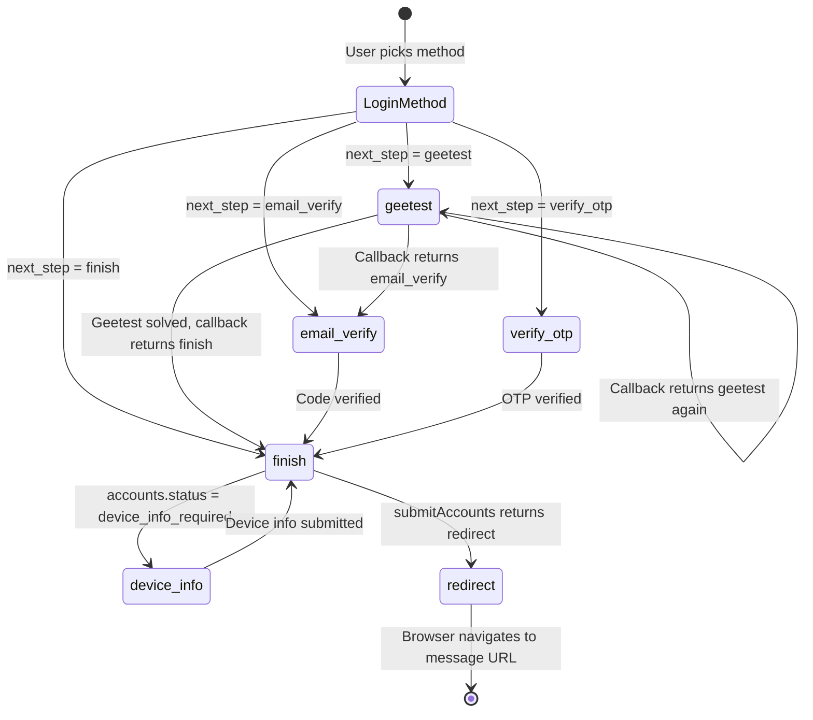
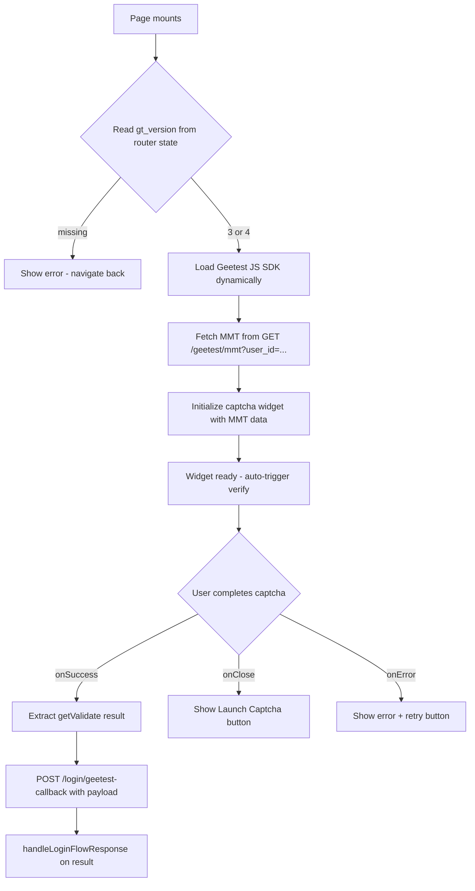

# Login Flow Refactor — `status` → `next_step`

## Summary

The backend changed `LoginFlowResponse` to remove the redundant `status` field. The response now uses only `next_step` with five possible values: `"geetest"`, `"email_verify"`, `"verify_otp"`, `"finish"`, `"redirect"`. Additionally, the Geetest page must be rewritten from a "fire callback immediately" stub into a real Geetest captcha widget renderer.

---

## New `LoginFlowResponse` shape

```python
class LoginFlowResponse(BaseModel):
    next_step: Literal["geetest", "email_verify", "verify_otp", "finish", "redirect"]
    gt_version: int | None = None
    message: str | None = None
```

Key changes:
- `status` field **removed** entirely
- `next_step` is now a required string (was `string | null`)
- `gt_version` is `3` or `4` (only present when `next_step === "geetest"`)
- `message` contains the redirect URL when `next_step === "redirect"`

---

## Architecture: Login Flow State Machine



---

## Shared `next_step` Router Utility

Currently, every login page duplicates the same branching logic in `onSuccess`. We will extract a shared helper:

**New file: `src/lib/login-flow.ts`**

```ts
import type { NavigateFunction } from 'react-router-dom'
import type { LoginFlowResponse } from '@/api/types'

export function handleLoginFlowResponse(
  data: LoginFlowResponse,
  navigate: NavigateFunction,
  options?: {
    onVerifyOtp?: () => void  // for mobile page local state
    onUnknown?: () => void
  }
) {
  switch (data.next_step) {
    case 'geetest':
      navigate('/geetest', { state: { gt_version: data.gt_version } })
      break
    case 'email_verify':
      navigate('/email-verify')
      break
    case 'verify_otp':
      options?.onVerifyOtp?.()
      break
    case 'finish':
      navigate('/finish')
      break
    case 'redirect':
      if (data.message) window.location.href = data.message
      break
    default:
      options?.onUnknown?.()
  }
}
```

The `gt_version` is passed via React Router `state` to the Geetest page so it knows which JS to load.

---

## File-by-File Change List

### 1. `src/api/types.ts` — Update types

| What | Detail |
|------|--------|
| Remove | `LoginFlowStatus` type alias |
| Change | `LoginFlowResponse.status` → remove field |
| Change | `LoginFlowResponse.next_step` → `'geetest' \| 'email_verify' \| 'verify_otp' \| 'finish' \| 'redirect'` (required, not nullable) |
| Add | `GeetestMMTResponse` — shape returned by `GET /geetest/mmt` |
| Add | `GeetestCallbackRequest` — v3 payload: `{ session_id, geetest_challenge, geetest_validate, geetest_seccode }` |

```ts
// New type for next_step
export type LoginFlowNextStep = 'geetest' | 'email_verify' | 'verify_otp' | 'finish' | 'redirect'

export interface LoginFlowResponse {
  next_step: LoginFlowNextStep
  gt_version: number | null
  message: string | null
}

// MMT data from GET /geetest/mmt?user_id=...
export interface GeetestMMTResponse {
  gt: string
  challenge: string
  new_captcha: boolean
  session_id?: string
  check_id?: string
  risk_type?: string
}

// Payload for POST /login/geetest-callback (v3)
export interface GeetestCallbackRequest {
  session_id: string
  geetest_challenge: string
  geetest_validate: string
  geetest_seccode: string
}
```

### 2. `src/api/login.ts` — Update API functions

| What | Detail |
|------|--------|
| Add | `getGeetestMMT(userId: number)` → `GET api/geetest/mmt?user_id={userId}` |
| Change | `geetestCallback()` → `geetestCallback(body: GeetestCallbackRequest)` — now accepts the solved captcha payload |

### 3. `src/hooks/use-login.ts` — Update hooks

| What | Detail |
|------|--------|
| Add | `useGeetestMMT()` — `useMutation` wrapping `getGeetestMMT` |
| Change | `useGeetestCallback()` — mutation now takes `GeetestCallbackRequest` as variable |

### 4. `src/lib/login-flow.ts` — **New file**

Shared `handleLoginFlowResponse()` helper as described above. All login pages will call this instead of duplicating switch/if-else logic.

### 5. `src/pages/geetest.tsx` — **Complete rewrite**

The current page just fires `geetestCallback` on mount and shows a spinner. The new page must:

1. Read `gt_version` from `useLocation().state` (passed when navigating to `/geetest`)
2. Read `userId` from `useLoginStore`
3. Dynamically load the Geetest JS SDK:
   - v3: `https://static.geetest.com/static/js/gt.0.5.0.js` → exposes `window.initGeetest`
   - v4: `https://static.geetest.com/v4/gt4.js` → exposes `window.initGeetest4`
4. Fetch MMT data from `GET /geetest/mmt?user_id={userId}`
5. Initialize the captcha widget with the MMT data
6. On success, extract `captcha.getValidate()` and `POST /login/geetest-callback`
7. Handle the callback response recursively via `handleLoginFlowResponse()`

Key implementation details:
- Use a `<div id="geetest-captcha" />` container for the widget
- Auto-trigger `.verify()` once ready
- Show a "Launch Captcha" button as fallback if auto-trigger fails
- Handle `onClose` (user dismissed) and errors gracefully
- Use `useRef` guard to prevent double-init in StrictMode

**Note:** v4 Geetest callback is currently broken at the backend schema level. The frontend should still load the v4 JS and render the widget, but the callback submission will fail until the backend fixes the union type. We can add a `TODO` comment for this. For now, only v3 is fully functional end-to-end.

### 6. `src/pages/login-email.tsx` — Migrate branching

Replace:
```ts
if (data.status === 'success') navigate('/finish')
else if (data.status === 'geetest_required') navigate('/geetest')
else if (data.status === 'email_verify_required') navigate('/email-verify')
```
With:
```ts
handleLoginFlowResponse(data, navigate)
```

### 7. `src/pages/login-devtools.tsx` — Same migration

Replace `data.status` checks → `handleLoginFlowResponse(data, navigate)`

### 8. `src/pages/login-raw-cookies.tsx` — Same migration

Replace `data.status` checks → `handleLoginFlowResponse(data, navigate)`

### 9. `src/pages/login-mod-app.tsx` — Same migration

Replace `data.status` checks → `handleLoginFlowResponse(data, navigate)`

### 10. `src/pages/login-mobile.tsx` — Migrate with OTP callback

Replace:
```ts
if (data.status === 'geetest_required') navigate('/geetest')
else if (data.status === 'otp_sent') setOtpSent(true)
```
With:
```ts
handleLoginFlowResponse(data, navigate, {
  onVerifyOtp: () => { setOtpSent(true); toast.success('...') }
})
```

And the verify handler:
```ts
// was: data.status === 'success' → navigate('/finish')
handleLoginFlowResponse(data, navigate)
```

### 11. `src/pages/email-verify.tsx` — Same migration

Replace `data.status` checks → `handleLoginFlowResponse(data, navigate)`

### 12. `src/pages/device-info.tsx` — Same migration

Replace `data.status` checks → `handleLoginFlowResponse(data, navigate)`

### 13. `src/pages/finish.tsx` — Update submit handler

The `submitAccounts` `onSuccess` currently checks `result.message?.startsWith('discord://')`. With the new schema, the response will have `next_step: 'redirect'` and `message` containing the URL:

```ts
onSuccess: (result) => {
  handleLoginFlowResponse(result, navigate)
}
```

This works because `handleLoginFlowResponse` handles `redirect` by navigating to `data.message`.

### 14. `src/router.tsx` — Route changes

The `/geetest` route is currently unguarded. It should stay unguarded (or be put behind `AuthGuard` — both work since the user is already authenticated by the time they reach geetest). The route itself doesn't change, but the component it renders is completely new.

No new routes needed.

### 15. `src/stores/login-store.ts` — No changes needed

The `userId` is already stored and accessible for the Geetest MMT fetch.

---

## Geetest Page: Detailed Component Flow



---

## Risks & Notes

1. **Geetest v4 backend bug** — The `/login/geetest-callback` endpoint only accepts v3 `SessionMMTResult` fields. The v4 payload shape is different. Frontend will render v4 widget but callback submission will fail. Mark with `TODO` comment.

2. **`gt_version` passing** — Using React Router `state` means the value is lost on page refresh. This is acceptable since the Geetest page is always navigated to programmatically from a login page, never bookmarked.

3. **QR code page** — `login-qrcode.tsx` uses its own `QRCodeStatusResponse` type (not `LoginFlowResponse`), so it is **not affected** by this refactor.

4. **Backward compatibility** — The `status` field is being fully removed from the type. There is no migration period — this is a breaking change that requires frontend and backend to deploy together.
